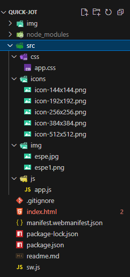
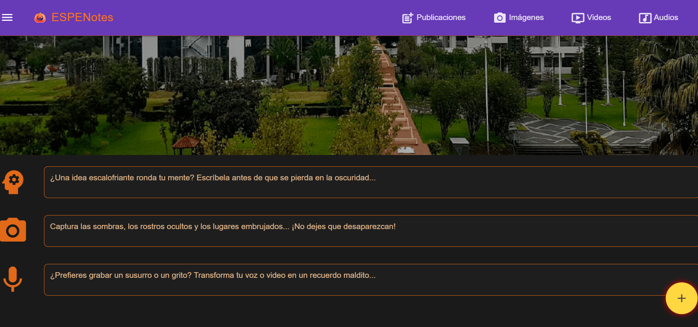
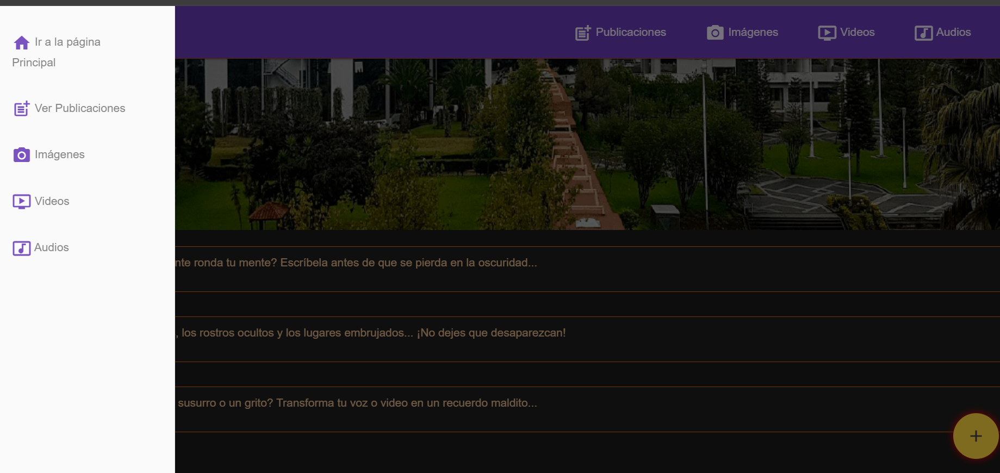
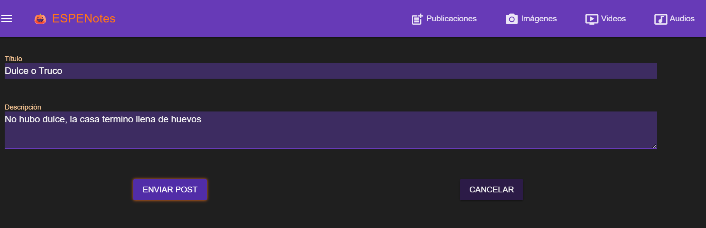
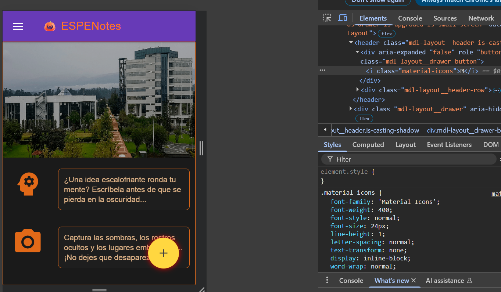

#  Desarrollo de una PWA Básica con Elementos de Material Design

**Quick Jot** es una aplicación web desarrollada como PWA que permite a los usuarios tomar notas de forma sencilla y rápida. Ofrece funcionalidad offline, instalación en dispositivos móviles, y una interfaz minimalista ideal para tareas diarias o uso académico.

## ¿Qué hace este proyecto?

- Permite crear notas con título y descripción
- Guarda las notas en localStorage
- Tiene una interfaz responsive y visualmente atractiva
- Usa Material Design Lite para componentes UI
- Incluye un Service Worker para funcionamiento offline
- Está optimizado como una Progressive Web App (PWA)

### Características 
-  Toma de notas sin conexión
-  Almacenamiento local (LocalStorage)
- Instalación como aplicación en dispositivos móviles
- Interfaz responsive y limpia
-  Código modular y fácilmente integrable

# Video de demostración 

[🔗 Ver video de demostración](https://uespe-my.sharepoint.com/:f:/g/personal/aacampos1_espe_edu_ec/EmbY57H0HzFJuCib9yTHMNABfyARoA_VNyTuae6NhRMAig?e=MSpLT2)  

## **Instalación**

Para instalar y configurar el proyecto en tu máquina local, sigue estos pasos:

### **1. Clona el repositorio**

Si aún no has clonado el repositorio, utiliza el siguiente comando para clonarlo:

```bash
git https://github.com/arquimides12/quick-jot.git 
```
En mi caso sucedio esto ya que cree el repositorio despues.

# Instala las dependencias
Entra en el directorio del proyecto y ejecuta el siguiente comando para instalar las dependencias:

```bash
npm install
npm start
```

Esto abrirá la aplicación en: 
```bash
http://localhost:8080
``` 
Puedes usarlo con cualquier servidor estático 

```bash
# Si tienes Python instalado
python -m http.server 8080
``` 

## Estructrua del Proyecto 



## Explicacion de la estructura 
```bash
quick-jot/
├── 📁 node_modules/              # Módulos y dependencias del proyecto
├── 📁 src/
│   ├── 📁 css/                   # Estilos CSS personalizados
│   │   └── app.css              # Estilos principales de la aplicación
│   ├── 📁 icons/                 # Iconos de la aplicación en diferentes tamaños
│   ├── 📁 js/                    
│   │   └── app.js               # Lógica principal de la aplicación tomar y guardar notas
├── index.html                   # Página principal de la aplicación
├── manifest.webmanifest.json   # Manifesto de la aplicación web (PWA)
├── package-lock.json            # Bloqueo de versiones de dependencias
├── package.json                 # Configuración del proyecto y scripts
└── sw.js                        # Service Worker para la aplicación cachea archivos para uso offline 
``` 

## Reutilización en Nuevos Proyectos

ESPENotes es modular y puede adaptarse fácilmente:

- Cambia los estilos en app.css
- Personaliza los campos del formulario
- grega categorías, etiquetas o filtros

> Pedes usar el `app.js`como modulo de manejar notas. 
- Clonar o copiar los archivos sw.js y manifest.webmanifest.json.
- Asegúrate de tener el siguiente <link> en tu index.html
```html
<link rel="manifest" href="manifest.webmanifest.json">
```

Registra el Service Worker en tu archivo JavaScript principal:

```js
if ('serviceWorker' in navigator) {
  navigator.serviceWorker.register('sw.js')
    .then(() => console.log('Service Worker registrado exitosamente.'))
    .catch(error => console.error('Error al registrar el Service Worker:', error));
}
```
Incluye tus íconos en la ruta especificada en el manifiesto.


# Progressive Web App (PWA)

ESPENotes incluye:

- manifest.webmanifest.json para instalación en dispositivos
- sw.js para cacheo de archivos y funcionamiento offline
- Íconos adaptables para diferentes resoluciones


## Recomendaciones 

- Asegúrate de que los estilos en app.css mantengan una paleta de colores coherente, tipografías legibles y espaciado uniforme.
- Divide el archivo app.js en módulos si empieza a crecer demasiado. Por ejemplo: notes.js, ui.js, storage.js.
- Linting y formateo: Asegúrate de tener configurado ESLint y Prettier correctamente para mantener un estilo de código limpio.

> ogressive Web APP(PWA)

- Validación del manifest: Verifica que manifest.webmanifest.json tenga todos los campos necesarios (name, short_name, icons, start_url, display, etc.).
- Service Worker funcional: Asegúrate de que sw.js maneje correctamente el caché y la actualización de recursos. 

## Ventajas 

- Offline-first: funciona sin conexión después de la primera carga.
- Instalable: puede anclarse en la pantalla de inicio como una app nativa.
- Sin backend: no necesitas servidor, ideal para pequeños proyectos educativos o personales.
- Rápido y ligero: sin frameworks pesados ni dependencias innecesarias.
- Fácilmente modificable: el código está separado por responsabilidades.

## Licencia 

MIT - Puedes usar libremente este código para fines personales, académicos o comerciales.

## Integración de Calidad de Código

- Este entorno incluye:

- ESLint: Encuentra errores y problemas de estilo.

- Prettier: Formatea el código automáticamente.

- Ambos integrados con scripts para ejecutarse fácilmente desde la terminal.

## Tencologias Usadas 

-`HTML`
-`CSS`
-`JavaScript`
- Service Workers
- Web App Manifest
- LocalStorage

# Ejecucion 
- Ejecución  http://192.168.1.18:8080/?# 



- Barra de manegación lateral



- Publicación de Post y eliminar 



- Codigo Responsivo 




